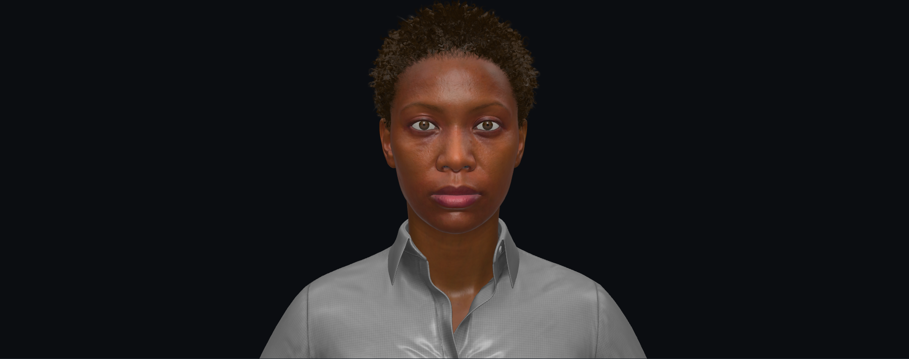

# MetaHuman → GLB

<p align="center">
  <a href="https://smorchj.github.io/metahuman-to-glb/">
    
  </a>
</p>

<p align="center">
  <a href="https://smorchj.github.io/metahuman-to-glb/">
    
  </a>
</p>

Deterministic five-stage pipeline that turns an Unreal Engine 5.7
MetaHumanCharacter into a web-ready, Draco-compressed GLB with all 51
ARKit blendshapes baked in, then publishes it as a browsable three.js
viewer on GitHub Pages.

The operator's job is to send a UE asset path and say "export this".
Everything else is automated — UE assemble, Sequencer-baked ARKit
shape keys, Blender material reconstruction, GLB compression, web
viewer build. **One Haiku sub-agent runs each stage**; Opus only wires
the dispatch.

## Live demo

**https://smorchj.github.io/metahuman-to-glb/** — gallery built from
`docs/` on every push to `main`.

## The 5 stages

```
operator: "export /Game/Foo/MHC_Foo"
   ↓
00 — UE assemble                    (Haiku · ~1-2 min)
01 — UE → GLB + Sequencer ARKit bake  (Haiku · ~1-2 min)
02 — Blender assemble + ARKit shape keys + groom propagation (Haiku · ~60-90 s)
03 — Blender → compressed GLB       (Haiku · ~30-60 s)
04 — three.js webview               (Haiku · ~5 s)
   ↓
docs/characters/<id>/<id>.glb       (~40 MB, 51 ARKit blendshapes)
```

Each stage is a pure script (Python / PowerShell). Each runs inside
its own Haiku sub-agent that loads only that stage's `CONTEXT.md` +
the current character's manifest — nothing else. That's the whole
isolation guarantee.

## ARKit blendshapes — the trick

UE's GLTFExporter strips morph names and bloats face GLBs to ~700 MB
when you ask for the 858 raw RigLogic morphs. UE's
`AnimSequence.get_anim_pose_at_frame()` only returns curve INPUTS, not
resolved bone transforms. UE's RigLogic Python bindings aren't
shipped (Epic engineer confirmed in
[issue #43](https://github.com/EpicGames/MetaHuman-DNA-Calibration/issues/43)).
Maya's the documented path, but you don't need it.

What works: build a transient Level Sequence with the
`AS_MetaHuman_ARKit_Mapping` track at **24fps display rate**
(matches source so each integer bake frame = one ARKit pose, no
inter-pose blending). Call
`SequencerTools.export_level_sequence_fbx()` — Sequencer's evaluator
fires RigLogic + correctives + bone resolution natively, gives back
an FBX with mesh + per-frame bone keyframes. Stage 02 replays that
FBX in Blender, scrubs to each pose's frame, captures the deformed
mesh via `evaluated_get(depsgraph)`, transfers shape keys to the GLB
face by KDTree position match (max distance: 0.00mm — same UE SKM,
same topology). Then propagates each ARKit shape onto eyebrow /
mustache / beard card meshes with k=4 inverse-distance² weighting so
the cards follow the face when a blendshape fires.

## How it works — ICM context layers

The orchestration follows the **Interpretable Context Methodology**:
the workspace is sliced into numbered folders, each with its own
`CONTEXT.md` contract declaring exactly which inputs it reads and
which outputs it writes. Opus authors those contracts once; Haiku
runs them.

When the operator says "export X":

1. Opus reads `CLAUDE.md` (auto-loaded), sees the export-routing rule.
2. Opus reads `5.7/native-glb/RUN.md`, the orchestrator playbook.
3. Opus runs `tools/bootstrap_character.py` to create
   `characters/<id>/` from the template.
4. Opus dispatches **one Haiku per stage**, sequentially. Each Haiku
   gets only its stage's `CONTEXT.md` + the character's manifest, runs
   the stage's launcher, verifies outputs against the contract, and
   updates **only its own** `stages.<NN>_*` block in the manifest.
5. Opus reports the final GLB path.

That stage isolation is load-bearing: if every stage pulled the whole
repo, a cheap model would fail; if it only pulls its declared
Inputs, it succeeds. The same isolation prevents an agent from
"helpfully" fixing a sibling stage's status when state looks
inconsistent — the dispatcher (Opus) owns cross-stage state, full
stop.

<p align="center">
  <a href="https://smorchj.github.io/metahuman-to-glb/icm-agent-flow.html">
    
  </a>
</p>

## Setup (one-time per machine)

1. Clone the repo.
2. Copy the config template:
   ```
   cp _config/pipeline.example.yaml _config/pipeline.yaml
   ```
   Edit the four `<...>` placeholders with your local paths to:
   - your `.uproject` (UE 5.7) containing your MetaHumanCharacter assets
   - `UnrealEditor-Cmd.exe`
   - `blender.exe` (Blender 5.x)
3. Have your MetaHumanCharacter ready in your UE 5.7 project under
   `/Game/<Name>/`.

`_config/pipeline.yaml` is gitignored, so your local paths never leak
into the repo.

## Running the pipeline

In Claude Code (or any LLM that has tool access to your filesystem):

```
operator: "please export /Game/Ada/MHC_Ada"
```

That's it. The orchestrator (Opus) handles bootstrap + dispatch; five
Haiku sub-agents run the stages sequentially; final GLB lands at
`5.7/native-glb/docs/characters/ada/ada.glb`.

If you want to invoke a single stage directly, every stage has a
PowerShell launcher:

```powershell
./5.7/native-glb/stages/00-unreal-assemble/tools/run_assemble.ps1 -Char ada
./5.7/native-glb/stages/01-unreal-glb-export/tools/run_export.ps1   -Char ada
./5.7/native-glb/stages/02-blender-assemble/tools/run_assemble.ps1  -Char ada
./5.7/native-glb/stages/03-export-to-glb/tools/run_export.ps1       -Char ada
./5.7/native-glb/stages/04-webview-build/tools/run_site.ps1         -Char ada
```

## Layout

```
<worktree>/
  CONTEXT.md                           Layer 1 — task routing
  CLAUDE.md                            Layer 0 — agent orientation
  _config/pipeline.example.yaml        committed config template
  _config/pipeline.yaml                gitignored — your local paths

  5.7/native-glb/                      ← active pipeline
    RUN.md                             operator entry point (Haiku-readable)
    tools/bootstrap_character.py       character-folder scaffolder
    stages/00-unreal-assemble/
      CONTEXT.md                       stage contract (Haiku reads only this)
      tools/run_assemble.ps1           stage launcher
    stages/01-unreal-glb-export/
    stages/02-blender-assemble/
    stages/03-export-to-glb/
    stages/04-webview-build/
    characters/_template/              copied per character at bootstrap
    characters/<id>/manifest.json      per-stage status (gitignored outputs)
    docs/characters/<id>/<id>.glb      stage 04 output (GitHub Pages)

  5.6/cinematic/                       legacy — see "Legacy & status" below
```

## Status

This is a **fun side project** that grew up. Currently running against
**Bo** and **Bruce** (5.7 native-glb) and **Ada** and **Taro** (5.6 cinematic)
from Epic's MetaHuman demo set — all four are in the live gallery.
Tested in Safari on iPhone X.

The 5.7 native-glb pipeline ships:

- Full ARKit-52 blendshape support (51 keys; `tongueOut` requires a
  rig variant Epic doesn't ship by default)
- Bone-driven deformation magnitude correct (jawOpen ~33mm,
  eyeBlinkLeft ~16mm, mouthSmileLeft ~18mm, etc.)
- Eyebrow / mustache / beard card meshes follow the face on every
  shape via inverse-distance-weighted shape-key propagation
- Hair-card rendering: alpha-to-coverage primary (single-pass, depth-writes,
  mobile-compatible), two-pass blend fallback, per-strand root darkening +
  tint variance from atlas channels, anisotropic specular along strand tangent.
  Per-character and per-material overrides (mode, colour, density).
- Texture cap at 1024 px, Draco mesh compression, ~40 MB final GLB
- MediaPipe FaceLandmarker driver in the viewer for live face capture

Known gaps:
- **Eyelash textures seem low-res.** Coverage texture may need
  exemption from the 1024 px downsample cap or a higher-quality source.
- **Eye occlusion has no alpha mask.** The eyeshell submesh renders
  as a flat 40% dark layer across the entire eye — needs MH's
  eyeshell occlusion mask wired as `alphaMap`
  ([#19](https://github.com/smorchj/metahuman-to-glb/issues/19)).
- **No scalp darkening under hair cards.** Hair cards sit on bare
  head skin
  ([#15](https://github.com/smorchj/metahuman-to-glb/issues/15)).
- **Asymmetric brow expressions are muted.** ARKit's `browInnerUp`
  is a single bilateral key (not split). Mitigation: per-side
  `browInnerUpLeft/Right` extras can be added from raw RigLogic
  morphs, but MediaPipe regresses them toward symmetry under low
  signal ([#17](https://github.com/smorchj/metahuman-to-glb/issues/17),
  [#18](https://github.com/smorchj/metahuman-to-glb/issues/18)).
- **Morph weights don't round-trip through FBX**, only bones do.
  Stage 02 captures bone-driven deformation but loses ~5-10mm of fine
  morph corrective detail (lip squash, wrinkle deltas). Acceptable
  trade for a fully-automated 5.7-native path.
- **Clothing picks the wrong base colour.** Mask-blended
  `diffuse_color_1/2` aren't wired through correctly
  ([#12](https://github.com/smorchj/metahuman-to-glb/issues/12)).

## Legacy & 5.6 cinematic

The original pipeline targeted UE 5.6.1 + the Cinematic build profile
(see `5.6/cinematic/`). Stage layout there is 4 stages (no UE-side
assemble) and ARKit shapes were transplanted from a precomputed NPZ.
It still works for the demo characters that were exported with it but
is no longer the recommended path. The 5.7 native-glb pipeline is
self-contained and produces real ARKit deformation magnitudes that
the 5.6 NPZ transplant couldn't.

A parallel `5.7/cinematic/` directory exists but is **unfinished** —
kept around for reference, not for production use.

## Contributing

Open source under the **MIT license**. PRs very welcome — especially
on the gaps above. File an issue first if it's a bigger architectural
change so we don't duplicate work.

The architecture invariants worth respecting:

1. **Per-version + per-pipeline boundary is hard.**
   `5.7/native-glb/` does not import from `5.6/cinematic/`.
2. **Stage isolation is load-bearing.** A stage agent reads only its
   own `CONTEXT.md` + Inputs; it updates only its own manifest block.
3. **Scripts transform; LLMs glue.** Every deterministic computation
   lives in `*.py` / `*.ps1`. Models call those scripts and verify
   outputs.

## License

MIT — see [LICENSE](LICENSE).
